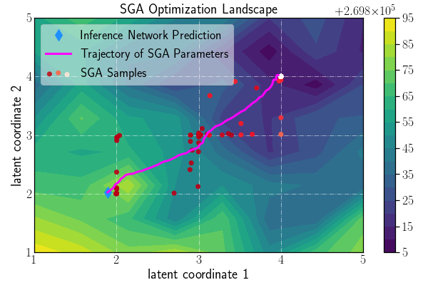

# Improving Inference for Neural Image Compression

Reimplementation in tensorflow 2.10.
Currently only the standalone SGA procedure (without bits-back) is supported.
See `demo.ipynb` for an example.

## Requirements
The code was tested on [tfc version 2.10.0](https://github.com/tensorflow/compression/releases/tag/v2.10.0).

All the dependencies can be installed by

    pip install tensorflow-compression==2.10.0

